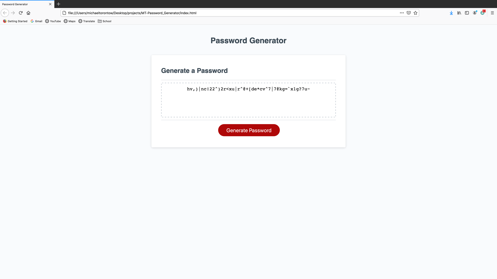

# Password Generator

[Final Product] "https://torontow.github.io/MT-Password_Generator/"

## The Project

The client requested an application that can generate a new password with varying levels of security, depending on user input.

The user is asked how many characters (between 8 and 128) they would like their password to include. Those characters will include integers from 0 through nine, and/or lowercase letters, and/or uppercase letters, and/or special characters. 

## The Process

Generally this was just a matter of making sure the logic of the application was sound. Thankfully, the HTML and CSS were provided. There may be some ways to consolidate the code to make it a shorter file, but leaving it as is makes it easy to decipher when reading it.

## Installation

Simply navigate to the site URL: "https://torontow.github.io/MT-Password_Generator/"

## Usage

Simply follow the prompts.

## License

MIT License

## Credits

W3 Schools (https://W3schools.com)

